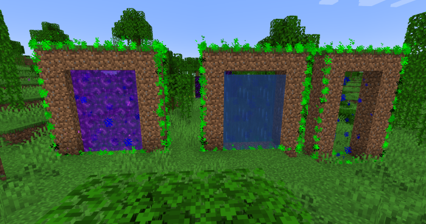
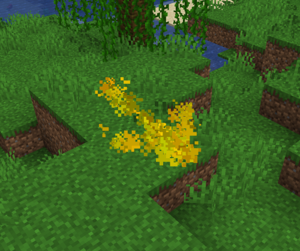

# Commands

:::info

**V2.0.0+ / recode info**

The re-code should detect that you have the old data and create copies in the new format, however you will need to re-do the config.

If the portals to not import for any reason, you can manually trigger the import by running `/portals import`.

Do not worry. The original data will not be deleted, and you can revert to older versions if you run into problems.

:::

All commands included in Advanced Portals are listed below along with their permissions.

**Note:** all `/portal` commands can also be used with `/advancedportals` or `/aportals` instead.

Same goes for all /destination commands can be used with /desti

Also if you want blocks such as nether portals not to break when being placed you will need to define the portal before placing them. This is so the physics updates know not to mess with vanilla portals being broken or other plugins :)

## Portal Command
Usable Alias: `/portal` `/ap` `/portals` `/aportal` `/advancedportals`

### `/portal create (tags...)`

**Permission:** `advancedportals.portal.create`

This command is used to create a portal. The behaviour of the portal can be determined by the tags given (see list below), but a name must tag must always be given `name:some_name_here`

As a side note, make sure to check the `triggerblock:` has been set if you are not using nether portal blocks. These are blocks that **you need to be INSIDE** so blocks such as water and even cobwebs will work, but cobblestone will not be a suitable triggerblock.

For a list of tags and info, check out the [tags page](./portal-tags.md).

### `/portal selector` or `/portal wand`

**Permission:** `advancedportals.portal.selector`

This gives you the mighty portal axe, if UseOnlyServerMadeAxe is true then this one will still work, but the normal iron axe will still be available to be used in survival for admins. (instead of always trying to make portals)

### `/portal portalblock`

**Permission:** `advancedportals.portal.create`

Gives you a portal block that you can build with. (If the rotation is in the wrong place one next to it and then replace it to get the right rotation)

### `/portal endportalblock`

**Permission:** `advancedportals.portal.create`

Gives you an end portal block that you can build with.

### `/portal gatewayblock`

**Permission:** `advancedportals.portal.create`

Gives you an end gateway block that you can build with.

### `/portal disablebeacon (portalname)`

**Permission:** `advancedportals.portal.disable_beacon`

Disable the end gateway blocks in the area of the portal. This should persist even after the chunk has reloaded.

### `/portal import`

**Permission:** `advancedportals.portal.import`

Imports portals and destinations from the old format. This will not overwrite any existing portals and destinations with the same name, however all common config values will be overwritten.

### `/portal langupdate`

**Permission:** `advancedportals.portal.lang_update`

Updates the language files with the latest strings. This will not overwrite any custom strings you have added though will add new translation keys to the end of the file.

If you want to reset it back to the default file you can enter `/portal langupdate overwrite`

### `/portal reload`

**Permission:** `advancedportals.portal.reload`

This will reload all the portal, destination and config data. Though some config values may need a server restart/full plugin reload.

### `/portal show`

**Permission:** `advancedportals.portal.show`

This will visualise nearby portals with particles as well as the current selection region.

[//]: # (Currently not implemented)
[//]: # (### `/portal select`)

[//]: # (**Permission:** `advancedportals.createportal`)

[//]: # ()
[//]: # (After the command is entered, punch inside a portal region, and it will select that portal.)

[//]: # ()
[//]: # (### `/portal unselect`)

[//]: # ()
[//]: # (**Permission:** `advancedportals.createportal`)

[//]: # ()
[//]: # (Use to remove the current portal selection. &#40;as it can mess with certain commands&#41;)

### `/portal remove`

**Permission:** `advancedportals.portal.remove`

Enter this command to destroy a portal with a set name. If the argument is left blank, it will destroy the currently selected portal.

### `/portal help`

Displays the help message.

### `/portal version`

Returns the current version of the plugin

## Destination Command

Usable Alias: `/desti` `/destination`

Permission (applies to all): `advancedportals.desti`

### `/desti create`
Permission: `advancedportals.desti.create`

This the command creates a new destination with the location data from your player (your player position and direction your facing).

### `/desti remove`
Permission: `advancedportals.desti.remove`

Remove a destination with a specific name. (portals will still attempt to warp to this name but say no destination exists)

### `/desti list`
Permission: `advancedportals.desti.list`

A list of created destinations.

### `/desti show`
Permission: `advancedportals.desti.show`

This will visualise the surrounding destinations with an arrow shaped particle formation. The arrows are roughly positioned at the player head height for the default player size.

### `/desti tp (desti name)`
Permission: `advancedportals.desti.teleport`

Teleport to the named destination.
